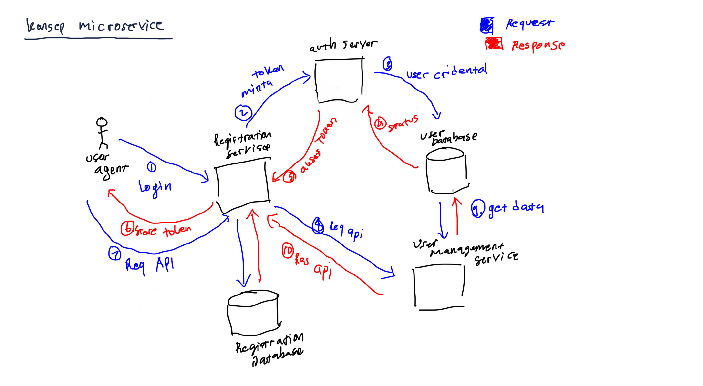

# Belajar microservice dengan SpringBoot

Aplikasi monolint: aplikasi web pada umumnya yaitu mengakses database secara shared atau istilah lainnya yaitu distributed database, dengan gambaran sebagai berikut:

## Aplikasi microservice: one service per database

Biasanya aplikasi microservice menggunakan konesep _one service per database_ dengan gambaran sebagai berikut:

